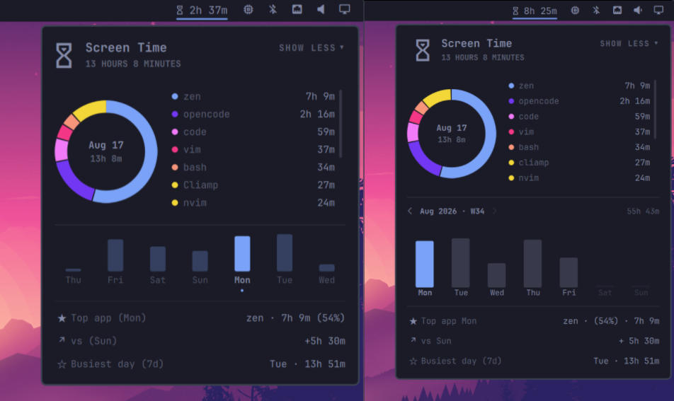

# Changelog

All notable changes to this project are documented here. The format is based
on [Keep a Changelog](https://keepachangelog.com/en/1.1.0/), and this project
adheres to [Semantic Versioning](https://semver.org/spec/v2.0.0.html).

## [Unreleased]

## [1.4.0] - 2026-09-01

### Added

- Wrapped-style yearly retro: the Insights year now reads a two-year per-day
  archive, so it shows active days, longest streak, top months, average
  active day, weekday rhythm, the single busiest day, and the year's share of
  your screen time. Days pruned from daily retention land in the archive
  instead of month lumps, and month-scale views (totals, bars, oldest year)
  understand it.
- Colour-coded insights: the top-app row glows gold, gains green / losses
  red, and the busiest-day row violet; only signed deltas take colour.

### Changed

- The sticky yearly header gains a small bottom pad, so the hero no longer
  butts against the scrolling month bars and insights.

### Fixed

- Chromium-family web apps no longer render as malformed names
  (`chrome-music.apple.com__…-Default` → `music.apple.com`), and usage of the
  same web app across browser profiles now folds into one row; dotted
  non-reverse-DNS names like `Minecraft* 26.2` pass through intact.
- The yearly retro's "average screen day" and "weekday rhythm" scale from
  day-granular data only, so a year that mixes pre-archive month lumps with
  archived days no longer inflates them.

## [1.3.0] - 2026-08-21

*v1.2.2 (left) vs v1.3 (right)*

### Added

- Yearly overview behind the hero hourglass: navigate back through every
  recorded year with `< year >`, see one bar per month scaled against the
  busiest month, hover any bar for its exact total, and return with BACK.
- Persistent monthly aggregates: when daily detail ages out of retention,
  its total folds into the month, so the yearly overview covers your whole
  history instead of forgetting it.
- 13-week paginated Mon-Sun trend with an ISO week header
  (`Aug 2026 · W34`) for travelling back three months at a glance.
- Clickable week total: flip between the summed duration and its share of
  the week's 168 hours.
- Donut cross-highlight: hovering a legend row highlights its ring slice,
  and hovering a slice highlights its row.
- Steam game titles: windows reported as `steam_app_<id>` resolve to the
  game's name from local Steam manifests before being tracked.
- Hourglass easter egg: it turns over on every full hour, and gold
  sparkles scatter around the cursor on hover.

### Changed

- Daily detail is retained for 95 days instead of 31, matching the
  13-week trend window; older days remain part of their monthly totals.
- Week bars follow the theme: today's bar in the accent colour, other days
  at low opacity, empty and future days as faint tracks.
- App list uses a fixed-height scroll area with vertically centred rows.
- Insights labels join to their values with a middle dot.

### Fixed

- Steam-aware names actually work now: the previous lookup ran Node-only
  APIs inside QML's engine, so `steam_app_*` entries broke their labels
  instead of showing game titles.

## [1.2.2] - 2026-08-19

### Fixed

- Live screen-time tracking now continues after each timer tick and correctly
  resumes after app resolution.

## [1.2.1] - 2026-08-19

### Added

- `State.js` state-machine module: bucket lifecycle, suspend detection, and
  midnight rollover extracted from `Service.qml` into pure, testable
  functions.
- `lib/browser_aliases.json` as single source of truth for browser
  canonicalization; `Model.js` and `resolve_app.py` read from it.
- `State.js` unit tests and data-safety test coverage for pruning, midnight
  rollover, and corrupt-input recovery.

### Changed

- Project reorganized: `Model.js` → `lib/Model.js`,
  `resolve_app.py` → `scripts/resolve_app.py`.

### Fixed

- Deprecated `Qt.include()` replaced with inline JSON to silence QML
  warnings.
- `persist()` calls restored after `State.js` extraction accidentally
  dropped them.
- `closeActiveBucket` consolidated through `State.closeActiveBucket` in
  rollover; remaining `root.closeActiveBucket` references removed.
- Service wired to `State.applyResolvedApp`; resolver aliases guarded
  against missing entries.
- Shadowed variable `d` renamed to `dt` in `commitElapsed`.

## [1.2.0] - 2026-08-18

### Added

- Interactive week-trend bars: click any day to view that day's apps,
  donut, hero total, and insights; click again or close the panel to
  return to today's live data. Active bar highlighted with an accent
  dot indicator.
- Scrollable app list: bounded legend with a thin scrollbar; Show More
  toggles the full app list inline (renamed from Patterns).
- Clean app names: reverse-DNS compositor IDs shortened to the last
  segment and title-cased (`com.github.user.Codium` → `Codium`).
- Donut slices below 3% auto-collapse into the "Other" bucket so the
  chart stays readable with many small apps.
- Donut centre now shows the full date ("Aug 15") instead of a
  hardcoded "TODAY" label.
- Insights always show three rows; missing data shows an em-dash
  placeholder instead of omitting the row.
- Empty donut draws a dim ring so the chart area is visible even with
  no tracked data for the selected day.

### Changed

- Panel close resets selected day only (expanded state preserved) so
  the panel always opens showing today's live data.
- Hero hourglass icon enlarged for better readability; subtitle font
  reduced to caption size.
- Insights labels use weekday names for all non-today items:
  "Top app (Fri)", "vs (Thu)"; today keeps "Top app" / "vs yesterday".
- Extra spacing between insights icon and label text.

### Fixed

- Week-trend bars no longer vanish when the selected past day has
  data; the section stays visible so the user can switch days.
- Insight icons (star, arrow, circle) render correctly with day-name
  labels via prefix matching instead of exact equality.
- Scrollbar ratio guarded against Infinity when content is empty.
- `busiestWeekDay` guarded against empty `todayKey` input.

## [1.1.0] - 2026-08-16

### Fixed

- Suspend and clock jumps no longer accrue wall-clock time as screen time: a
  bucket crossing a suspend gap is dropped instead of counting the sleep,
  and the gap baseline is re-anchored so tracking resumes from the moment of
  wake. A 5s heartbeat keeps the baseline fresh, so suspends from ~30s up
  are detected instead of only multi-minute ones.
- The idle screensaver and xdg desktop-portal windows no longer count as
  tracked apps, matching the "idle and locked time is never counted" claim.
- A corrupt `history.json` is preserved (moved aside) before tracking
  resumes, instead of being silently overwritten and losing all history.
- Terminal resolution now also covers Omarchy's own terminal
  (`org.omarchy.terminal`), which was previously tracked as itself.
- Panel no longer emits `Unable to assign [undefined] to QString` warnings at
  startup: chart data is gated on the service being ready, and the Model
  helpers tolerate empty day keys.
- Resolver runs are guarded against overlap, and a watchdog kills a stuck
  resolver process and re-arms the refresh timer so terminal tracking
  recovers instead of stalling forever.

### Changed

- README gains a concise "At a glance" feature list for the plugin listing.

## [1.0.0] - 2026-08-15

Initial marketplace release.

### Added

- Long-running screen-time service: tracks focused time per app, persists to
  `~/.config/omarchy/screen-time/history.json`, and survives shell restarts
  and plugin reloads.
- Terminal resolution (`resolve_app.py`): reports what is actually running
  inside a focused terminal (e.g. `opencode` rather than `foot`), with
  per-browser canonicalization so browsers aggregate under a single key.
- Bar widget: today's total as "glyph + time", right-click toggles to an
  icon-only mode (remembered in the widget entry).
- Popup panel: donut chart with legend, hover highlighting (slice highlight,
  dimmed siblings, app name + time in the centre), and behaviour insights
  (top app, vs. yesterday, busiest day in 7).
- Donut slices beyond six collapse into an "Other" bucket so the chart stays
  readable with many apps.
- History retention: days older than 31 are pruned automatically.
- Theme integration: slice colours are generated from the theme accent, so
  the palette follows theme swaps.
- Tests for the pure logic (`Model.js`, `resolve_app.py`) and a CI workflow.

### Changed

- Icon-only underline now aligns with the painted glyph (OpticalGlyph).
- README screenshots live under `assets/`.

### Fixed

- Open-panel indicator drifted off the icon-only glyph (Nerd Font ink sits
  offset within its advance box).
