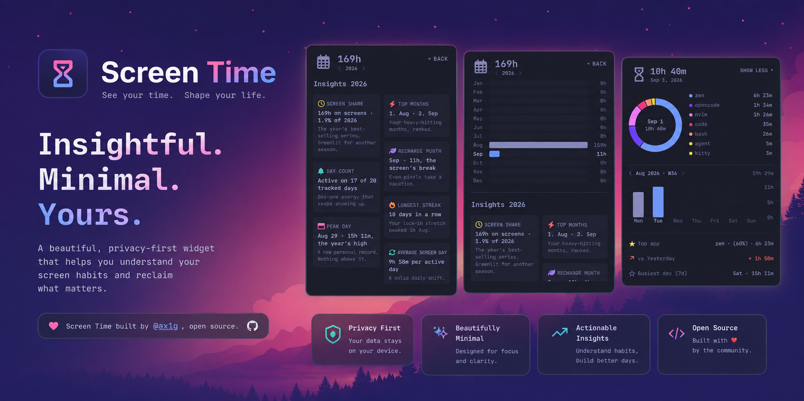

<p align="center">
  
</p>

# Screen Time

Know where your time goes. A lightweight service tracks focused time per app,
shows today's total in the bar, and breaks your history into a donut chart, a
13-week trend, and a yearly overview — terminal-aware, keyboard-first, fully
local.

## Features

| Feature | What it does |
| --- | --- |
| **Live in the bar** | Today's total, updated as you work. |
| **Per-app tracking** | Focus time per app; idle, locked, asleep and desktop time never counted. |
| **Terminal-aware** | A focused terminal shows what runs inside it (`opencode`, not `foot`), re-resolved live. |
| **Steam-aware** | `steam_app_123456` becomes the game title, read from local Steam metadata. |
| **Donut chart** | Six biggest apps + "Other", day total in the centre. |
| **Cross-highlight** | Hover a slice or legend row to spotlight that app. |
| **Clean names** | Reverse-DNS IDs shortened; Chromium web apps fold by hostname across profiles. |
| **Scrollable app list** | Bounded legend with a thin scrollbar; Show More expands the full list. |
| **Clickable week bars** | Click any day to inspect it; click again to return to today. |
| **13-week trend** | Paginated Mon–Sun pages with ISO-week header; today in your theme accent. |
| **Week total** | Header total flips between time and share of the week's 168 hours. |
| **Yearly overview** | Per-month bars across every recorded year, with a Wrapped-style yearly retro: day counts, longest streak, top months, weekday rhythm, peak day. |
| **Usage patterns** | Top app, vs yesterday, busiest day in 7. |
| **Icon-only mode** | Right-click collapses the widget to a single glyph; remembered. |
| **Keyboard-first** | `Esc` closes, `p` toggles patterns, `j`/`k` and arrows scroll; wheel works too. |
| **Keybind-friendly** | Summon and control the panel from a keybind via the `agx.screen-time` IPC target. |
| **Hourglass easter egg** | Flips over on the hour; gold sparkles on hover. |
| **Private by design** | One local JSON file; old days roll into a two-year per-day archive, then monthly totals; colours follow your theme accent. |

## Install

```bash
omarchy plugin add https://github.com/ax1g/quickshell-screentime-plugin.git
omarchy plugin enable agx.screen-time
```

Requires Omarchy and Hyprland. A Nerd Font provides the glyphs, and
`python3` (preinstalled on Omarchy) powers terminal and Steam name
resolution — without it the plugin still tracks, but terminals show under
their own name (`foot`, `kitty`) instead of what runs inside them.

## Uninstall

```bash
omarchy plugin disable agx.screen-time
omarchy plugin remove agx.screen-time
```

To also delete the history file:

```bash
rm ~/.config/omarchy/screen-time/history.json
```

## Data

Everything lives in one local file, `~/.config/omarchy/screen-time/history.json`:

```json
{
  "days": {
    "2026-08-16": { "total": 490875, "apps": { "zen": 313349, "opencode": 148706 } }
  },
  "months": {
    "2026-07": 9823400
  },
  "years": {
    "2026": { "2026-08-15": 582190 }
  }
}
```

- Per-app focus time in milliseconds, keyed by day (`YYYY-MM-DD`).
- Focus is credited to the day it started on, so a session spanning midnight
  still lands on the right day.
- Daily detail older than ~3 months (95 days, matching the 13-week trend) is
  pruned, but its total folds into a per-day archive first — the current and
  previous calendar year's day totals survive as `"years"`, so the yearly
  overview keeps day counts, streaks, and peak days even though raw app
  detail is forgotten. Older years live on as per-month aggregates. Delete
  the file to reset.

## Development

The shell hot-reloads the plugin whenever a file changes, so a symlink into
your checkout is all you need to iterate:

```bash
ln -s "$PWD" ~/.config/omarchy/plugins/agx.screen-time
node --check lib/Model.js && node --check lib/State.js
node --test tests/model.test.js tests/state.test.js
python3 -m unittest discover -s tests
```

The same checks run in CI on every push.

## License

MIT
